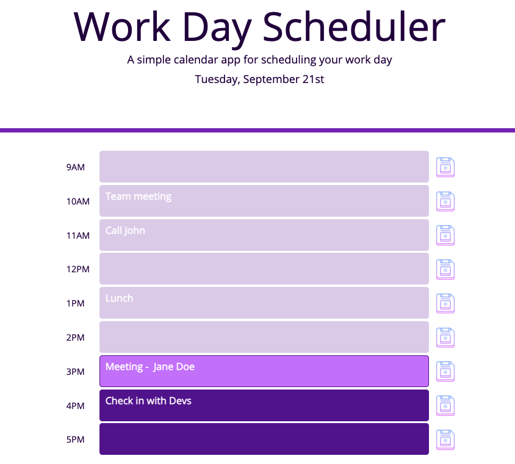

# Work Day Scheduler

> A simple daily work planner.
> Live demo [_here_](https://lilyso.github.io/work-day-scheduler/).

## Table of Contents

- [General Info](#general-information)
- [Technologies Used](#technologies-used)
- [Features](#features)
- [Screenshots](#screenshots)
- [Setup](#setup)
- [Project Status](#project-status)
- [Room for Improvement](#room-for-improvement)
- [Acknowledgements](#acknowledgements)
- [Contact](#contact)
- [License](#license)

## General Information

This is a daily work day planner where users are able to block out time for appointments. The user can refer back to the schedule each time they open the browswer.

## Technologies Used

- HMTL5
- CSS3
- JavaScript

## Features

- User can add their appointments and notes to the schedule for business hours.
- Current date is displayed.
- Time blocks will show if appointment is in the past, present or future so that the user is able to see upcoming events clearly.

## Screenshots

## Setup

Download from repository.

## Project Status

Project is: _in progress_

## Room for Improvement

Room for improvement:

- Ability to save all notes at once. Currently, user input can only be saved one at a time.

## Acknowledgements

- Colour scheme generated by [coolors](https://www.coolors.com/)

## Contact

Created by [lilyso](https://github.com/lilyso).

## License

- MIT
